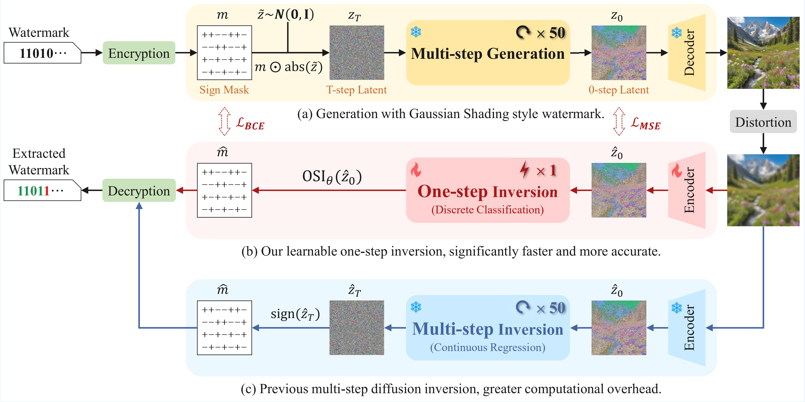

<h1 align="center"> 
    <a href="https://arxiv.org/abs/2602.09494">OSI</a>
</h1>

<a href="https://arxiv.org/abs/2602.09494"></a>
<a href="https://huggingface.co/VIPL-GENUN/OSI"></a>

> **[OSI: One-step Inversion Excels in Extracting Diffusion Watermarks](https://arxiv.org/abs/2602.09494)** \
> [Yuwei Chen](https://scholar.google.com/citations?view_op=list_works&hl=zh-CN&hl=zh-CN&user=Q302tJ8AAAAJ)<sup>1,2</sup>, [Zhenliang He](https://lynnho.github.io)<sup>1,2✉</sup>, [Jia Tang](https://Jostarss.github.io)<sup>1,3</sup>, [Meina Kan](https://scholar.google.com/citations?hl=zh-CN&user=4AKCKKEAAAAJ)<sup>1,2</sup>, [Shiguang Shan](https://scholar.google.com/citations?user=Vkzd7MIAAAAJ)<sup>1,2</sup> \
> <sup>1</sup>State Key Laboratory of AI Safety, Institute of Computing Technology, CAS, China \
> <sup>2</sup>University of Chinese Academy of Sciences (CAS), China \
> <sup>3</sup>School of Information Science and Technology, ShanghaiTech University, China

<p align="center">
    
</p>


We introduce OSI, a fast and accurate method for extracting the initial noise sign from diffusion-generated images, with exceptional performance in Gaussian Shading style watermark extraction.


## 🛠️ Installation

Clone this repo:

```shell
git clone https://github.com/VIPL-GENUN/OSI.git
cd OSI
```

Create and activate a new conda environment:
```shell
conda create -n osi python=3.8.20
conda activate osi
```

Install dependencies:
```shell
pip install -r requirements.txt
```


## 🤖️ Download Models

We have provided the OSI model for Stable Diffusion v2.1 on [HuggingFace](https://huggingface.co/VIPL-GENUN/OSI). Weights for other versions, including SD3.5 and SDXL, will be updated soon. You can download it using the following command:

```shell
huggingface-cli download VIPL-GENUN/OSI
```


## 🚗 Usage

### 📦 Data & Model Preparation

Prepare the pre-trained Stable Diffusion weights and the OSI model weights, then update paths in the command/script:
   - `--model_path`: Stable Diffusion checkpoint path
   - `--unet_path` / `--encoder_path`: OSI UNet / encoder checkpoints
   - `--dataset_path`: Stable Diffusion Prompts or MS-COCO datasets path

### 🛠️ Workflow

Our inference process `run_osi_sd21.py` starts by loading the Stable Diffusion Prompts dataset, the pre-trained Stable Diffusion (v2.1), and our OSI model (both UNet and Encoder). In each step, the system takes a prompt from the dataset to generate a watermarked image. This image is then put through an attack to test robustness. Finally, the OSI model processes the attacked image to predict the signs of the initial latent noise, from which the hidden watermark message is extracted.

### 🚀 Quick Start

Run a single distortion example:

```bash
python run_osi_sd21.py \
  --num 1000 \
  --image_length 512 \
  --guidance_scale 7.5 \
  --num_inference_steps 50 \
  --channel_copy 1 \
  --hw_copy 8 \
  --fpr 0.000001 \
  --output_path ./output/ \
  --dataset_path <dataset_path> \
  --model_path <stable_diffusion_model_path> \
  --unet_path <osi_unet_ckpt> \
  --encoder_path <osi_encoder_ckpt> \
  --distortion_name Jpeg \
  --jpeg_ratio 25
```

Run all distortion presets in one go:

```bash
bash scripts/run_osi.sh
```

**Note on Scripts**: For more examples involving different adversarial attacks or clean (no-attack) evaluations, please refer to the configurations in `scripts/run_osi.sh`.


## 📚 Acknowledgements

We borrow the code from [Tree-Ring Watermark](https://github.com/YuxinWenRick/tree-ring-watermark.git) and [Gaussian Shading](https://github.com/bsmhmmlf/Gaussian-Shading.git). We appreciate the authors for sharing their code.


## ✏️ Citation

If you find our work helpful, please consider citing:

```bibtex
@article{chen2026osionestepinversionexcels,
      title={OSI: One-step Inversion Excels in Extracting Diffusion Watermarks}, 
      author={Yuwei Chen, Zhenliang He, Jia Tang, Meina Kan, Shiguang Shan},
      journal={arXiv preprint arXiv:2602.09494},
      year={2026}
}
```

